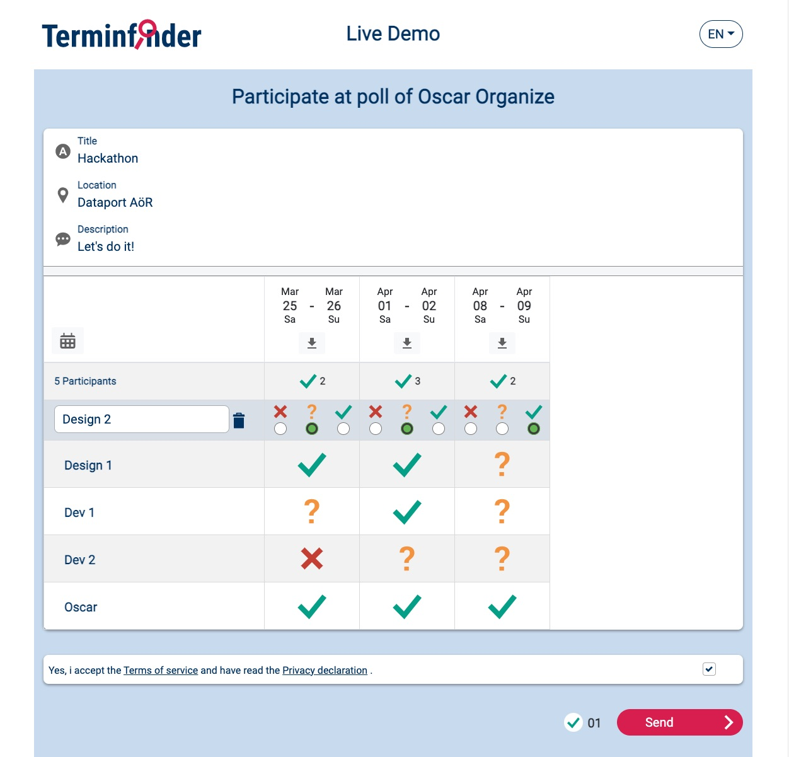

# Terminfinder-SH (Frontend)

Digital polls from Northern Germany - made by Dataport and the state of Schleswig-Holstein

The "Terminfinder" offers a fast and easy way to create digital polls.

**Digitale Abstimmungen aus dem Norden - ein Angebot von Dataport und dem Land Schleswig-Holstein**

Mit dem Terminfinder können Sie schnell und einfach digitale Abstimmungen für Gruppen realisieren.

Licensed under the EUPL 1.2

Copyright © 2022-2024 Dataport AöR

[SECURITY.md](./docs/SECURITY.md)



## Beschreibung

Der Terminfinder (Frontend, Backend, Datenbank) ermöglicht es schnell und unkompliziert Terminabstimmungen
durchzuführen. Wählen Sie einfach einen Titel für Ihre Umfrage und bei Bedarf den Ort aus, an welchem Ihr Termin
stattfinden soll. Schon können Sie loslegen und den Link zu Ihrer Umfrage mit Ihrem Umfeld teilen. Mithilfe des
Terminfinders können Sie flexibel entscheiden, ob Sie verschiedene Tage, verschiedene Uhrzeiten oder eine Kombination
aus beidem zur Abstimmung stellen wollen. Für eine erhöhte Sicherheit ist es darüber hinaus möglich eine Umfrage mit
einem Passwort zu versehen. Das schlanke Design des Terminfinders sorgt dafür, dass Sie und die Teilnehmenden sich
unkompliziert zurechtfinden können. Nach Ablauf der letzten Terminoption werden die Daten gemäß der
Standard-Einstellungen im Backend automatisch gelöscht. Somit werden Daten nur so lange aufbewahrt wie dies notwendig
ist.

### description

The "Terminfinder" (frontend, backend, database) allows you to quickly and easily create polls for appointments. Simply
select a title for your poll and, if required, the location where the appointment should take place. Afterwards you can
directly get started and share the link to your poll with those you want to share it with. With the help of the "
Terminfinder" you can flexibly decide whether you want to offer different days, different times or a combination of both
within your poll. For increased security it is also possible to set a password for your poll. The slim design of the "
Terminfinder" ensures that you and the participants can easily navigate through the application. In addition, the "
Terminfinder" only collects necessary data which is not shared with third parties. After the last appointment option
expires the data is automatically deleted. Thus, data is kept only as long as necessary.

## Parametrisierung

Folgende Parameter können gesetzt werden, indem Umgebungsvariablen während des Pre-Build-Prozesses zur Verfügung stehen.

Beispiel: ```export TITLE='Terminfinder-SH' API_URL='https://test.de/api' EMAIL='beispiel@beispiel.de' && npm run build-prod```

| env-variable                     | docker* | type                     | default                                | description                                                           |
|----------------------------------|---------|--------------------------|----------------------------------------|-----------------------------------------------------------------------|
| TITLE                            | ja      | `string`                 | ''                                     | Headline                                                              |
| LOCALE                           | ja      | `'de-DE'` or `'en-EN'`   | `'de-DE'`                              | Initiale Sprache, bis User die Sprache ändert                         |
| ADDRESSING (used on german only) | ja      | `'du'` or `'sie'`        | `'du'`                                 | Wird der User geduzt oder gesiezt. Nicht vom User anpassbar.          |
| API_URL                          | ja      | `string` (url)           | ''                                     | URL des Backends. Bei keinem Wert wird die aktuelle URL verwendet     |
| COLORS                           | ja      | `string` (json object)   | null                                   | Anpassung der Farben. Siehe Kapitel [Farben](#farben)                 |
| PRODUCTION                       | -       | `boolean`                | `true`                                 | Flag für Angular, Log-Level, Timeout-Zeit für XHR                     |
| VERSION                          | -       | `string`                 | package.json - version                 | Versionsnummer, die im Impressum angezeigt wird                       |
| DOCKER                           | -       | `boolean`                | `false`                                | Sollen Parameter zum Start des Docker-Images angepasst werden können. |
| SURVEY_LINK_ADMIN                | -       | `string` (url)           | ''                                     | falls vorhanden, Link für Nutzerbefragung von Umfrage-Admins          |
| SURVEY_LINK_USER                 | -       | `string` (url)           | ''                                     | falls vorhanden, Link für Nutzerbefragung von Umfrage-Teilnehmenden   |
| EMAIL                            | -       | `string` (email address) | 'demo@example.com'                     | E-Mail-Adresse des First-Level-Supports für Nutzende                  |
| CUSTOMER_ID                      | -       | `string` (uuid)          | '00000000-0000-0000-0000-000000000000' | Anwendung ist Mandantenfähig - Mandanten-ID                           |
| IMPRINT                          | -       | `string` (html)          | `<h2>Herausgeber</h2>...`              | Impressum - als `innerHTML`, string mit HTML-Tags                     |
| PRIVACY                          | -       | `string` (html)          | `<h2>privacy</h2>`                     | Datenschutzerklärung - als `innerHTML`, string mit HTML-Tags          |
| TOS                              | -       | `string` (html)          | `<h2>tos</h2>`                         | Nutzungsbedingungen - als `innerHTML`, string mit HTML-Tags           |
| ACCESSIBILITY                    | -       | `string` (html)          | `<h2>accessibility</h2>`               | Barrierefreiheitserklärung - als `innerHTML`, string mit HTML-Tags    |

*: Ist die Umgebungsvariable `DOCKER==='true'`, werden mit "ja" gekennzeichnete Parameter im kompiliertem Code mit
z.B. `@TITLE@` hinterlegt, um zur Laufzeit des Containers ersetzt zu werden. (docker-replace-parameters.sh)

## Farben

Farben können entweder über die Umgebungsvariable `COLORS` oder über einen Cookie gesetzt werden. Cookies verden hierbei zuletzt angewand und überschreiben Werte aus der Umgebungsvariable.

Beispiel Umgebungsvariable:

```bash
export COLORS='{"primary":"#ff0000","secondary":"#00ff00"}'
```

Beispiel Cookie:

```js
document.cookie = 'primary=#ff0000';
document.cookie = 'secondary=#00ff00';
```

**Hinweis**: Refresh ist Nötig, damit die Cookies wirken.

### Liste aller Farben und ihre Defaultwerte

| Color Name                        | Default Value  |
|-----------------------------------|----------------|
| `primary`                         | `#003064`      |
| `primary-lighter-10`              | `#004691`      |
| `secondary`                       | `#b3003e`      |
| `light-gray`                      | `#F5F6F7`      |
| `medium-gray`                     | `#909498`      |
| `dark-gray`                       | `#595959`      |
| `focus-border`                    | `#003064`      |
| `toolbar-background-color`        | `#d9dfe7`      |
| `primary-background-color`        | `#c9daef`      |
| `danger`                          | `#b3003e`      |
| `bootstrap-form-control-color`    | `#495057`      |
| `footer-text-color`               | `#b3003e`      |
| `border-color-input`              | `#909498`      |
| `border-color-divider-icon-input` | `#909498`      |

## Development

[contributing](./docs/CONTRIBUTING.md)

[contributor-agreement](./docs/CONTRIBUTOR-AGREEMENT.md)

### install and run

```bash
npm install
npm start
npm run backend-mock
```

### build

```bash
npm install
npm run build-prod
# or
npm run build-test
```

compiling to directory `dist`

### automated tests

E2e integration tests with cypress `npm run cy-open-local`

### create sbom

```
npm run generate-bom
```
